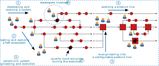

### Research

I am a software-engineering researcher specializing on the development and evolution of variant-rich software systems. Variant-rich systems exist in different customizable variants and have become the most widely existing form of software systems in all areas of society. My goal as a researcher is to improve our foundational understanding of how the respective software evolves, focusing on the interplay of human cognition and software quality. Evolving variant-rich systems is particularly challenging for developers, and during my PhD studies I have found that developers' comprehension of their system is the most important factor to engineer high-quality (variant-rich) software. These findings have fascinated me to follow a scientific career on this topic, for which I provide a conceptual sketch in Figure 1.
 
 

Typically, developers start to develop and evolve a single system (1). When this system becomes successful and has to be adapted for new customers, the developers start to create clones (e.g., via forking on GitHub) of the system, thereby creating a variant-rich system (A), that can be easily modified (2)). With the increasing number of cloned variants, the developers involved easily lose their understanding of the system (B), which, in turn, can amplify quality problems that propagate through all variants (C). During my PhD, I was particularly concerned with moving from such a fork-based variant-rich system towards a product line (3), which represents an integrated and configurable platform of all relevant variants to ease future evolution (4). With my PhD, I contributed to tackling long-standing problems around developers comprehension of variant-rich systems (e.g., ) and the involved economics (e.g., ) to decide whether moving to a product line is beneficial for an organization (3). To obtain this data, I have extensively collaborated with industry (e.g., Axis AB). Other companies have also been interested in and used the data for their decision making, too (e.g., Danfoss). Importantly, while my work on the economics of variant-rich systems has confirmed and systemized many common beliefs, it has also refuted and challenged established assumptions researchers made about the benefits and drawbacks of cloning compared to product-line engineering (A).

After my PhD, I have continued to intensify my research on the interplay of developers' cognition (B) and software quality (C) during the evolution of variant-rich systems (A). For instance, in our recent works on developers (B), we explored how the COVID-19 pandemic impacted developers that were involved in developing contact-tracing () and certificate-verficiation apps (). Among others, we found that the involved developers faced new challenges due to the emergency nature of the situation and public demand for their app, suggesting directions for applied software-engineering research to support developers in other emergency situations. Moreover, we have contributed a large meta-review in which we connect different areas of software-engineering based on a concept we call software-change intentions (). A software-change intention captures what the developers actually wanted to achieve when evolving their software. This notion has been inherent to various research topics on software evolution, but this concept has not been studied explicitly before. I try to transfer my insights on developers' cognition by engineering prototypes that can support developers in comprehending their software. Most recently, we have proposed a number of visualizations to make sense of variant-rich systems that are based on forks and their evolution (). Currently, we aim to extend our current prototype into a useful tool for practice.

Regarding the consequent impact on software quality (C), we have conducted several studies on quality problems that may arise from developers' misconceptions and their potential impact. My focus here lies on architecture smells that challenge future evolution and system vulnerabilities that can cause harms. For instance, we have recently interviewed developers at ASML to derive a catalog of unintended dependencies in their software (). While an unintended dependency does not mean that the software fails, developers may not anticipate that it exists, which challenges their comprehension and can later result in a smelly system. We have further studied to what extent the quality of variant-rich systems can be improved by reusing the contributions of other developers (). Specifically, we have studied whether the test cases within specific forks could be used to improve the quality of other forks.

Besides these core topics of mine, I have also published papers on improving scientific methods and practices. For instance, we have studied the reliability of literature search engines offered by computer-science publishers when we noticed during an own literature review that these returned different and inconsistent results (). Such publications are a byproduct of my core research.

<b>Projects and funding</b>

<ul>
  <li>Understanding the Importance of Non-Knowledge for Software Engineering on Social-Coding Platforms (INKleSS), German Research Foundation 2024-2027</li>
  <li>FOSD Meeting 2024, NWO Scientific Meetings and Consultations 2024</li>
  <li>Cognitive Biases in Software Engineering, Otto-von-Guericke University Magdeburg Innovation Fund 2022-2024</li>
  <li>Go SPLC 2019 Challenge project, Pure-Systems GmbH 2018-2019</li>
  <li>IFI Fellowship, German Academic Exchange Service 2020</li>
  <li>ACM SIGSOFT CAPS Travel Award</li>
  <li>Research Visits Fellowship, German Academic Exchange Service 2018</li>
  <li>Erasmus Traineeship Grant, European Union 2018</li>
  <li>ACM SIGAPP STAP Grant</li>
  <li>Conference Traveling Fellowship, German Academic Exchange Service 2017</li>
</ul>

<b>Awards</b>

<ul>
  <li>Distinguished Reviewer Award, SPLC 2023</li>
  <li>bridgefield Award for Software Engineering from Saxony-Anhalt (special award for dissertation), bridgefield GmbH 2023</li>
  <li>Award for the best dissertation of the Faculty for Computer Science, Otto-von-Guericke University Magdeburg 2022</li>
  <li>Research Award, Association of German Chambers of Industry and Commerce (IHK) Magdeburg 2022</li>
  <li>Research Award of the Faculty for Computer Science for overall research achievements, Otto-von-Guericke University Magdeburg 2020</li>
  <li>Frank Anger Memorial Award, ACM SIGSOFT 2019</li>
  <li>3rd ACM Student Research Competition at ESEC/FSE 2019</li>
  <li>Best Presentation Award Faculty Doctoral Symposium, Otto-con-Guericke University Magdeburg 2019</li>
  <li>Wernigeröder Research Award, Stadtwerkestiftung Wernigerode 2017</li>
  <li>Best Graduate Master Business Informatics, Otto-con-Guericke University Magdeburg 2016</li>
</ul>

<b>Some interesting reads</b>

<ul>
  
  <li><a href="assets/papers/Broneske2024ArtifactSharing.pdf" target="_blank" rel="me noopener noreferrer">Proceedings of the ACM on Software Engineering (FSE) 2024</a>: We have reviewed the state-of-the-art concerning (re-)sharing software-evolution data, such as repositories, their metadata, or associated tools’ data. We discussed our findings with an ethics expert to provide recommendation for researchers regarding how to deal with legal, ethical, and technical problems. Our goal is that these recommendations help researchers in improving and facilitating their efforts towards open science.</li>
  
  <li><a href="assets/papers/papers/Krueger2024FinancialIncentivesGuidelines.pdf" target="_blank" rel="me noopener noreferrer">Empirical Software Engineering 2024</a>: Financial incentives (i.e., money) are extensively used to motivate participation in empirical studies. In economics, financial incentives are furthermore bound towards real-world behavior that is mimicked within experiments to improve realism and motivate participants’ to execute the tasks correctly. As part of this research, we have proposed a set of guidelines and recommendations on how to use financial incentives in software-engineering experiments to improve their validity when they involve tasks that require effort.</li>
  
  <li><a href="assets/papers/Gnoyke2024ArchitectureSmellEvolution.pdf" target="_blank" rel="me noopener noreferrer">Journal of Systems and Software 2024</a>: In this article, we report on our work towards tracing the evolution of architecture smells within software systems. Architecture smells are indicators of quality problems that can become more and more serious over time if they are not addressed. We provide the first tooling and an empirical study to shed light into the evolution of three types of architecture smells in Java, underpinning that the smells go through complex evolution patterns.</li>
  
  <li><a href="assets/papers/Krueger2024ChangeIntentions.pdf" target="_blank" rel="me noopener noreferrer">ACM Computing Surveys 2024</a>: We have performed a meta review to structure existing software-engineering research based on software-change intentions, which represent the underlying intention a developer had when implementing a change to their software. We argue that structuring, studying, and specifying software-change intentions can be helpful to improve software evolution and assure that developers implement their intended changes.</li>
  
  <li><a href="assets/papers/Enaya2024CoronaWarnAppDevelopment.pdf" target="_blank" rel="me noopener noreferrer">Journal of Systems and Software 2024</a>: We have conducted a case study on the development of the Germany Corona-Warn App at SAP to understand how the emergency situation of developing an app to mitigate the apdenmic during the pandemic changed development processes and impacted the developers involved.</li>
  
  <li><a href="assets/papers/Zellmer2024EEDecisionMaking.pdf" target="_blank" rel="me noopener noreferrer">IEEE Transactions on Engineering Management 2024</a>: Within this article, we have collected the various definitions of terms used within different product-structuring concepts, including software product-line engineering and electrics/electronics platforms, among others. By synthesizing a terminological overview and providing a conceptual model based on industrial experiences, we aim to help researchers and practitioners in aligning their terminologies and obtaining a better understanding of what has already been done in other research areas.</li>
  
  <li><a href="assets/papers/Holsten2024EEPlatformTransition.pdf" target="_blank" rel="me noopener noreferrer">International Conference on the Foundations of Software Engineering 2024</a>: We have conducted 24 interviews with practitioners from the automotive industry to gain insights into their current practices and challenges of transitioning from their traditional to modern systems platforms. We found that particularly managing and evolving the new platforms as a whole are causing needs for improving platform management and evolution.</li>
  
  <li><a href="assets/papers/Zellmer2024EEDecisionMaking.pdf" target="_blank" rel="me noopener noreferrer">International Conference on the Foundations of Software Engineering 2024</a>: Automotive companies face strategic challenges regarding the evolution of their platforms every day. Through 26 interviews with experts, we elicited practitioners’ challenges, key requirements, practices, as well as needs, regarding their decision-making on platform evolution.</li>
  
  <li><a href="assets/papers/May2024CovidCertificateVerification.pdf" target="_blank" rel="me noopener noreferrer">Journal of Systems and Software 2024</a>: We report the experiences of developing a COVID-19 certificate verification system within a startup, eliciting how the pandemic, startup context, and developing an app for enabling public life impcated the developers' work.</li>
  
  <li><a href="assets/papers/Groot2024Dependencies.pdf" target="_blank" rel="me noopener noreferrer">ICSE-SEIP 2024</a>: We have interviewed developers at ASML to understand unintended software dependencies (e.g., architecture smells) in real-world, multi-lingual systems; finding that these are often similar to unintended dependencies in mono-lingual systems. Unintended dependencies by themselves are not causing errors in a system, but they complicated developers' comprehension due to unexpected dependencies reducing the quality of a software system.</li>

  <li><a href="assets/papers/May2024Education.pdf" target="_blank" rel="me noopener noreferrer">ICSE-SEET 2024</a>: We have reported our experiences of integrating video-creation tasks in a requirements-engineering course with the intention of increasing student participation and interaction.</li>

  <li><a href="assets/papers/Chen2024ForkVis.pdf" target="_blank" rel="me noopener noreferrer">SANER 2024</a>: We have analyzed a community discussion about GitHub's network graph, based on which we designed and evaluated visualizations intended to help developers explore variant-rich fork ecosystems.</li>

  <li><a href="assets/papers/Mukelabai2023TestCaseSharing.pdf" target="_blank" rel="me noopener noreferrer">ASE 2023</a>: We analyzed to what extent test cases within fork ecosystems are reused, finding that there is huge potential for sharing more test cases to improve the quality of other forks across an ecosystem to improve its quality.</li>
  
  <li><a href="assets/papers/Assuncao2023MicroserviceEvolution.pdf" target="_blank" rel="me noopener noreferrer">Journal of Systems and Software 2023</a>: We analyzed for 11 open-source microservice systems to what extent their changes are tangled with respect to what microservices and what types of changes they involve, finding that there seems no focus or clear separation of distinct business/microservice-oriented changes.</li>

  <li><a href="assets/papers/Coremans2023ProcessMiningTFS.pdf" target="_blank" rel="me noopener noreferrer">ICSME 2023 Industry Track</a>: We worked with Thermo Fisher Scientific to design a new process-mining technique that analyzes Jira issues, enabling us to recover and shed light into developers' process activities that are not fully visible in typical version-control data.</li>

  <li><a href="assets/papers/Alchokr2022ReviewingDynamics.pdf" target="_blank" rel="me noopener noreferrer">EASE 2022</a>: We conducted a survey among software engineering researchers to explore the challenges they observe for junior researchers to actively participate in the community.</li>

  <li><a href="assets/papers/Shakeel2022LiteratureAnalyses.pdf" target="_blank" rel="me noopener noreferrer">EASE 2022</a>: We propose a technique that incorporates various metrics to facilitate the discovery, selection, and quality assessment of publications during literature analyses.</li>

  <li><a href="assets/papers/Ananieva2022ConceptualModelExtension.pdf" target="_blank" rel="me noopener noreferrer">Empirical Software Engineering 2022</a>: We have proposed a conceptual model for unifying variability in space and time (i.e., the evolution of variant-rich systems) to guide contemporary research and tool development.</li>
 
  <li><a href="assets/papers/Shakeel2022Altmetrics.pdf" target="_blank" rel="me noopener noreferrer">JCDL 2022</a>: We report on a large study of the computer science community in which we compare citations and altmetrics for a number of high reputation venues to understand how representative or complementary altmetrics can be, for instance, for literature analyses.</li>
  
  <li><a href="assets/papers/Alchokr2021ArticleRecommendation.pdf" target="_blank" rel="me noopener noreferrer">JCDL 2021</a>: We performed a comparative survey of existing article recommendation platforms, which help research disseminate and discuss their publications after they have been accepted.</li>

  <li><a href="assets/papers/Kuiter2021varied.pdf" target="_blank" rel="me noopener noreferrer">Empirical Software Engineering 2021</a>: With funding from pure-systems GmbH, we have formalized and implemented operations in a tool that enables collaborative, distributed feature modeling for software product lines; which works similar to Google Docs for text.</li>

  <li><a href="assets/papers/Lindohf2021LargeFEF.pdf" target="_blank" rel="me noopener noreferrer">Empirical Software Engineering 2021</a>: We have instantiated the Family Evaluation Framework for assessing software product-line engineering in a company, reporting how to use the framework for managing and monitoring the evolution of a product line.</li>

  <li><a href="assets/papers/Gnoyke2021ArchSmellsEvolution.pdf" target="_blank" rel="me noopener noreferrer">ICSME 2021</a>: We advanced existing tools to conduct a novel mining study on the evolution of architectural smells in open-source software and their impact on software quality (e.g., cyclic dependencies have particular impact).</li>

  <li><a href="assets/papers/Sueruecue2020KeyPerformanceIndicators.pdf" target="_blank" rel="me noopener noreferrer">ESEC/FSE Industry Track 2020</a>: We contribute an experience report of how a large German company implemented and benefited from measuring key performance indicators to quantify the quality and process of its software development.</li>
  
  <li><a href="assets/papers/Heumuller2020Artifacts.pdf" target="_blank" rel="me noopener noreferrer">Empirical Software Engineering 2020</a>: We have studied how software research artifacts are (and should be) shared, indicating that researchers should be motivated to publish their artifacts in persistent repositories.</li>
  
  <li><a href="assets/papers/Krueger2020ReplicatingSLRs.pdf" target="_blank" rel="me noopener noreferrer">Empirical Software Engineering 2020</a>: We report on a large-scale experiment that shows the limitations and problems of search engines in computer science, indicating clear threats to the conduct and replication of literature reviews.</li>
  
  <li><a href="assets/papers/Krueger2020CostComparision.pdf" target="_blank" rel="me noopener noreferrer">ESEC/FSE 2020</a>: We elicited data through a literature review and interviews to collect reliable empirical insights on the costs of clone- and platform-based software reuse; confirming many established hypotheses, but also refuting some.</li>

  <li><a href="assets/papers/Fenske2020ifdefDilemma.pdf" target="_blank" rel="me noopener noreferrer">ICSME 2020</a>: We conducted a large-scale study with open-source developers, revealing that while they preferred refactored preprocessor directives, they actually performed worse in two program comprehension tasks; and had particular challenges in understanding the configurability of the source code.</li>

  <li><a href="assets/papers/Krueger2020DevelopersRecall.pdf" target="_blank" rel="me noopener noreferrer">ICSME 2020</a>: In this paper, we investigated how reliably developers could still remember knowledge about their system from memory, aiming to investigate how to better support them during software evolution (i.e., when they require what knowledge).</li>

  <li><a href="assets/papers/Krueger2019Traceability.pdf" target="_blank" rel="me noopener noreferrer">ESEC/FSE 2019</a>: We report an online experiment in which practitioners solved six comprehension tasks while exposed to different types of feature traces typically used for engineering variant-rich systems, indicating that virtual traces (i.e., annotations) can facilitate program comprehension.</li>

  <li><a href="assets/papers/Nesic2019Principles.pdf" target="_blank" rel="me noopener noreferrer">ESEC/FSE 2019</a>: We elicited a collection of feature modeling principles from the literature and interviews with practitioners to facilitate the construction of feature models for variant-rich systems (particularly product lines).</li>
  
  <li><a href="assets/papers/Krueger2019FeatureFacets.pdf" target="_blank" rel="me noopener noreferrer">Journal of Systems and Software 2019</a>: We investigated how to recover feature facets for two open-source systems, showing what information sources in social-coding platforms (e.g., GitHub) can be helpful to understand important properties of the features in a system and their evolution.</li>

  <li><a href="assets/papers/Nielebock2019Comments.pdf" target="_blank" rel="me noopener noreferrer">Empirical Software Engineering 2019</a>: We conducted a large experiment in which developers had to comprehend smaller code examples with different types of comments, with our results and comparison to the related work indicating that comments are less helpful for smaller code excerpts and that developers often mistrust them.</li>

  <li><a href="assets/papers/Krueger2018Remember.pdf" target="_blank" rel="me noopener noreferrer">ICSE 2018</a>: This was the first study on the memory of software developers, indicating that different factors we can measure about software evolution can impair or improve how well developers can remember their code.</li>
</ul>

